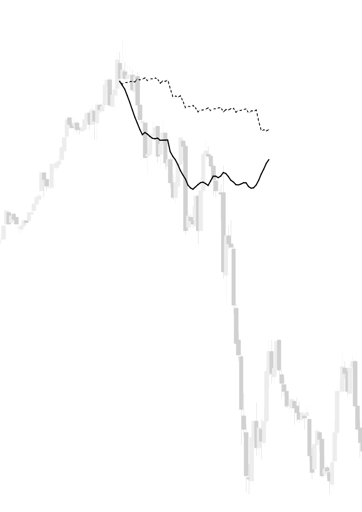

# Sequence-to-Sequence Learning of Financial Time Series in Algorithmic Trading

This is my bachelor's thesis that I wrote over the course of two months during my final year of studies, earning my Bachelor of Science in Computer Science degree.  The thesis was co-authored by my good friend [Tobias Ånhed](http://github.com/tobiasanhed).

### [Click here to read the thesis.](http://philiparvidsson.com/thesis.pdf)
*[Click here for revised edition on DiVA](http://www.diva-portal.org/smash/record.jsf?pid=diva2%3A1142444&dswid=-3843)*

## Abstract
Predicting the behavior of financial markets is largely an unsolved problem. The problem has been approached with many different methods ranging from binary logic, statistical calculations and genetic algorithms. In this thesis, the problem is approached with a machine learning method, namely the Long Short-Term Memory (LSTM) variant of Recurrent Neural Networks (RNNs). Recurrent neural networks are Artificial Neural Networks (ANNs)—a machine learning algorithm mimicking the neural processing of the mammalian nervous system—specifically designed for time series sequences. The thesis investigates the capability of the LSTM in modeling financial market behavior as well as compare it to the traditional RNN, evaluating their performances using various measures.

## Acknowledgements
We'd like to express our gratitude to our supervisor, Patrick Gabrielsson, without whom this thesis would not have been written. He has guided us throughout our research and shared with us his vast knowledge and experience in the fields of quantitative finance and machine learning.

## Compiling the document
If you want to compile the thesis document on your own, run `python make.py` in the project root directory. If you intend to work continuously on the thesis, run `python make.py watch` to have [pymake2](https://github.com/philiparvidsson/Pymake2-Build-Tool) automatically recompile the document after a change has been detected.

### Prerequisites
* Any [TeX distribution](https://en.wikipedia.org/wiki/TeX) (e.g. [TeX Live](https://www.tug.org/texlive/))
* [Python 2.7](https://www.python.org/downloads/release/python-2713/)

## Post-mortem
Being limited to roughly two months of work with no real prior knowledge, we felt that there was not enough time to detail a thorough plan for performing the thesis research. Had we started the thesis project with the knowledge we have now, we would have approached the problem differently—likely with a q-learning approach ([Gabrielsson, 2015](https://pdfs.semanticscholar.org/b294/6734f555a39eb34a50360b27d9bf799449c8.pdf)); attempting to predict profitable trading operations rather than predicting market behavior.

Despite this, we feel that we were very successful in developing high-quality software (which is now being used in research) with Python/Keras/TensorFlow for pursuing further research within the fields of econometrics, machine learning and algorithmic trading.

Lastly, and perhaps most importantly, we learned a tremendous amount during the time of writing the thesis and performing the research, greatly expanding our knowledge in the fields of machine learning and finance.

## Contributors
* Philip Arvidsson - *Author* - [philiparvidsson](https://github.com/philiparvidsson)
* Tobias Ånhed - *Author* - [tobiasanhed](https://github.com/tobiasanhed)
* Patrick Gabrielsson - *Supervisor* - [PAGA](http://www.hb.se/en/Shortcuts/Contact/Employee/PAGA)
